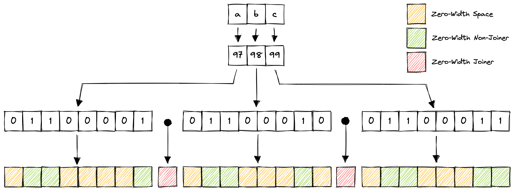

# Zero-Width Encoding

A text-to-invisible-text encoding scheme that encodes text in binary using the
invisible characters zero-width space, zero-width non-joiner and zero-width
joiner to represent 0, 1 and the end of each byte respectively.



## Benchmarks

```
cpu: Apple M1 Pro
runtime: deno 1.29.3 (aarch64-apple-darwin)

benchmark         time (avg)             (min … max)       p75       p99      p995
---------------------------------------------------- -----------------------------
encodeString    2.48 µs/iter      (2.4 µs … 3.15 µs)   2.52 µs   3.15 µs   3.15 µs
decodeString    6.24 µs/iter      (6.2 µs … 6.35 µs)   6.24 µs   6.35 µs   6.35 µs
```
